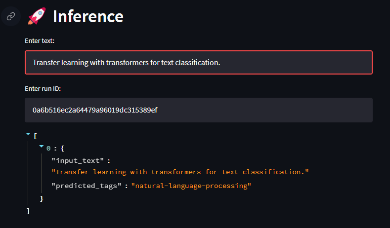

# NLP project
This is a little project I did to sharpen my skill in Machine Learning concepts and DevOps. 
You can follow the instruction below to run the code

## Setting up virtual environment
It is recommended to use Python version 3.9.1
```bash
python3 -m venv venv
source venv/bin/activate
python3 -m pip install pip setuptools wheel
python3 -m pip install -e .
```

## Workflow
```
python bnai/main.py elt-data
python bnai/main.py optimize --args-fp="config/args.json" --study-name="optimization" --num-trials=10
python bnai/main.py train-model --args-fp="config/args.json" --experiment-name="baselines" --run-name="sgd"
python bnai/main.py predict-tag --text="Transfer learning with transformers for text classification."
```

## API
```
uvicorn app.api:app --host 0.0.0.0 --port 8000 --reload --reload-dir bnai --reload-dir app  # dev
gunicorn -c app/gunicorn.py -k uvicorn.workers.UvicornWorker app.api:app  # prod
```

## View the result in dash  board
```
streamlit run app.py
```

This will open up a browser tab automatically, and you can interact with it.

### Data


### Inference


### Performance


Shout out to [Goku Mohandas](https://madewithml.com/) for his guidance in this project.
